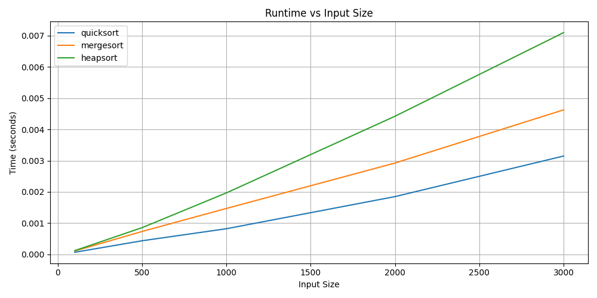
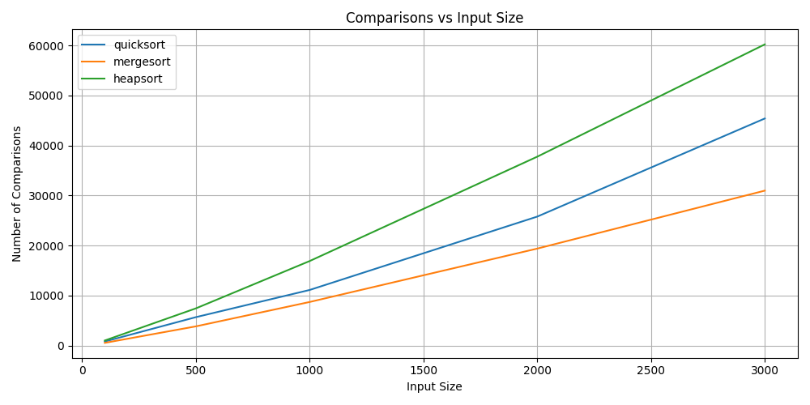

# CodeQuest: Sorting Algorithm Benchmark CLI

This project benchmarks the performance of classic sorting algorithms using a Python command-line interface (CLI). It supports runtime analysis, comparison tracking, and visualization of sorting behavior across increasing input sizes.

Features

- 🔁 Implements 4 classic sorting algorithms:
  - Quicksort
  - Mergesort
  - Heapsort
  - Bubblesort (optional for comparison)
- 📊 Benchmarks runtime and number of element comparisons
- 📈 Plots input size vs runtime and comparisons using `matplotlib`
- 🧪 CLI interface with flexible input sizing and algorithm selection
- 📁 Modular project structure

## 🚀 How to Use

Clone the repo:

```bash
git clone https://github.com/YOUR_USERNAME/codequest-sorting-benchmark.git
cd codequest-sorting-benchmark
```

Set up environment:

```bash
python3 -m venv .venv
source .venv/bin/activate
pip install -r requirements.txt
```

### CLI Commands

```bash
# Benchmark a specific algorithm
python cli.py --algo quicksort --size 1000

# Compare all algorithms on the same input
python cli.py --compare

# Generate runtime and comparison graphs
python cli.py --graph
```

## 🖼️ Sample Graphs

### Runtime vs Input Size


### Comparisons vs Input Size


## 🧠 What I Learned

- Practical performance differences between algorithms with the same Big-O
- Visualization helps reveal real-world scaling behavior
- Python's quirks (e.g., mergesort slower due to list copying) impact performance beyond complexity

## 📂 Project Structure

```
codequest/
├── cli.py
├── algorithms/
│   └── sorting/
│       ├── quicksort.py
│       ├── mergesort.py
│       ├── heapsort.py
│       └── bubblesort.py
```

## ✅ Future Improvements

- Add unit tests with `pytest`
- Add memory usage tracking
